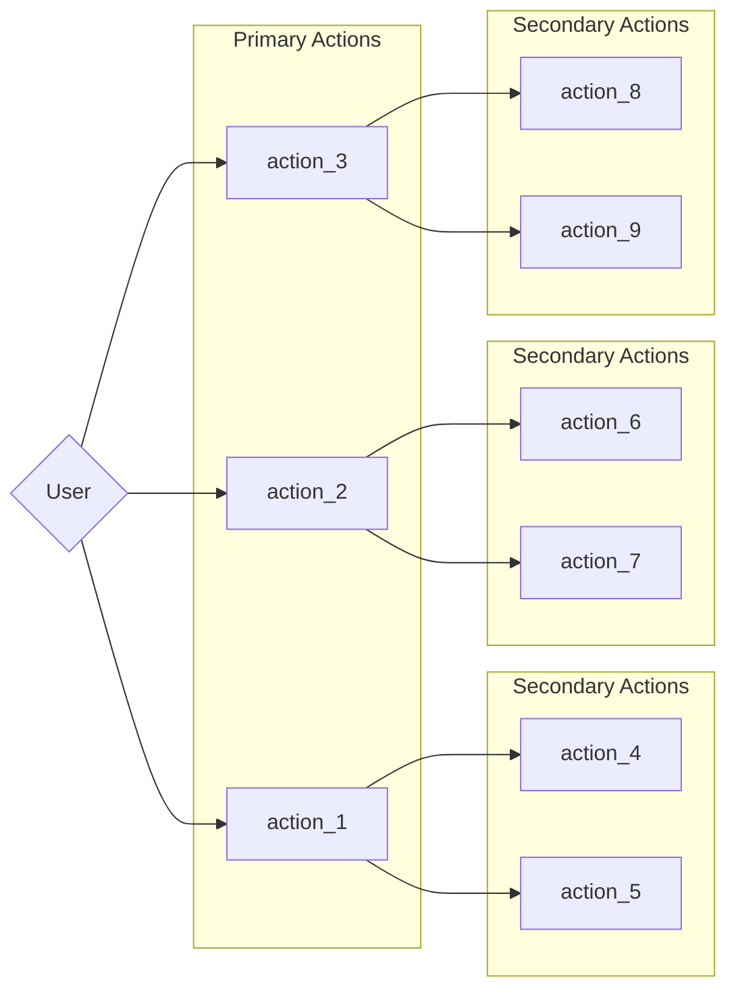

Analysis Phase: Use Case Diagram - Template

```mermaid
flowchart LR
    A{User} --> action_1 & action_2 & action_3
    subgraph Primary Actions
        direction LR
        action_1 & action_2 & action_3
    end
    
    action_1 --> action_4 & action_5
    subgraph Secondary Actions
        direction LR
        action_4 & action_5
    end
    
    action_2 --> action_6 & action_7
    subgraph Secondary Actions
        direction LR
        action_6 & action_7
    end
    
    action_3 --> action_8 & action_9
    subgraph Secondary Actions
        direction LR
        action_8 & action_9
    end
    
```